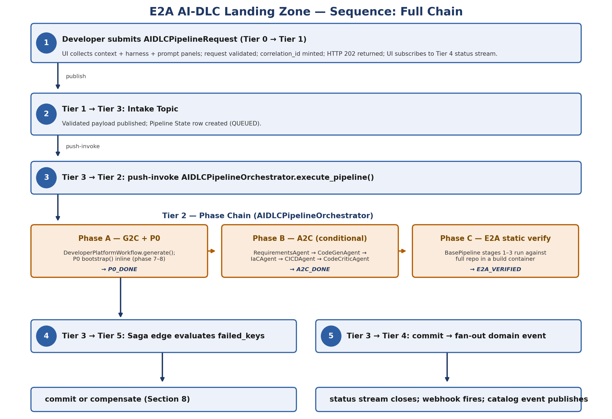
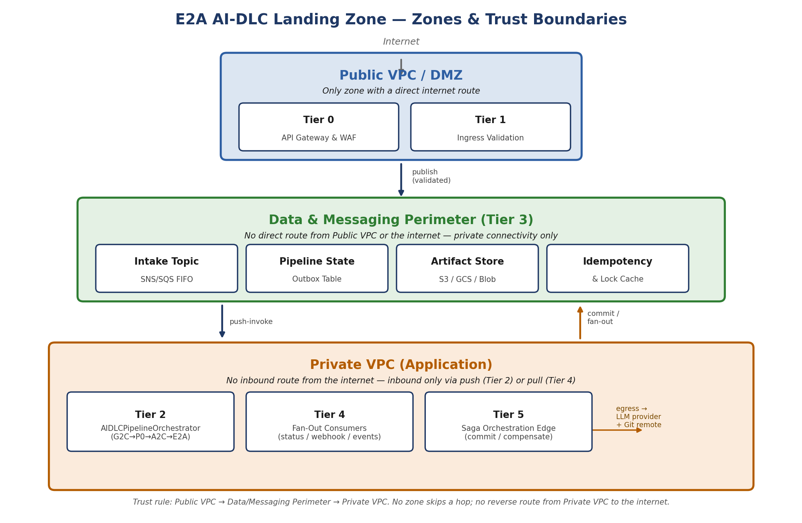
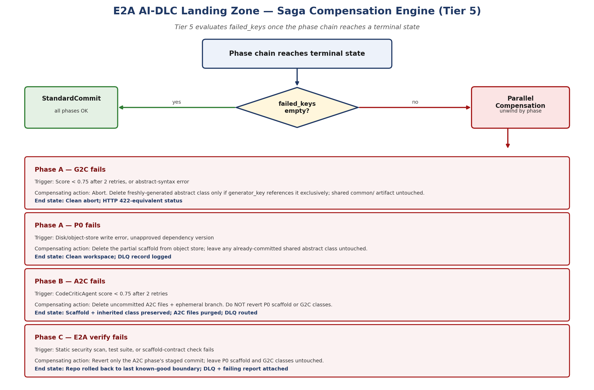

# E2A AI-DLC Landing Zone

### High-Level Design — Automated Polyglot AI-Assisted SDLC Profile

*Vendor-neutral cloud topology for the E2A AI-DLC (AI-Assisted Software Development Life Cycle) Profile — the composed, cloud-native, Saga-governed pipeline that operationalizes G2C, P0, and A2C as one service a developer triggers from a single UI action.*

| | |
|---|---|
| Document Version | 1.0.0 |
| Author | Subham Gupta, Staff Architect & AI Architect |
| Classification | Architecture Reference — Cloud Infrastructure, AI-DLC Profile |
| Companion documents | [CLOUD_LANDING_ZONE.md](CLOUD_LANDING_ZONE.md) — the Agentic profile; Sections 6–7 there sketch the conceptual G2C→P0→A2C relationship this document operationalizes. [CQRS_CLOUD_LANDING_ZONE.md](CQRS_CLOUD_LANDING_ZONE.md) + [CQRS_IMPLEMENTATION_PLAYBOOK.md](CQRS_IMPLEMENTATION_PLAYBOOK.md) — source of the tier-numbering and propagation-contract conventions this document reuses. |
| Scope | Infrastructure- and topology-focused: network zones, compute tiers, the AIDLCPipelineOrchestrator's phase composition, Saga compensation, NFR sizing, and vendor mapping across AWS/GCP/Azure. |

## 1. Executive Summary & Positioning

This document specifies the AI-DLC profile of the E2A cloud landing zone. It is the third documented profile, alongside the Agentic profile ([CLOUD_LANDING_ZONE.md](CLOUD_LANDING_ZONE.md)) and the Deterministic CQRS profile ([CQRS_CLOUD_LANDING_ZONE.md](CQRS_CLOUD_LANDING_ZONE.md) + [CQRS_IMPLEMENTATION_PLAYBOOK.md](CQRS_IMPLEMENTATION_PLAYBOOK.md)). It is a profile, not a fork: it reuses the same three network zones, the same six-tier numbering, and the same cross-class propagation contract established by those two documents, extended by one field (`trace_context`) exactly as the CQRS profile already extended it.

Where the Agentic profile answers "how does a single governed agent run in the cloud," and the CQRS profile answers "how does a deterministic command/query service run in the cloud," this profile answers a different question: "how does the framework stack that GENERATES those services run in the cloud." It operationalizes G2C, P0, and A2C — previously described as three separate frameworks with a conceptual relationship sketched in [CLOUD_LANDING_ZONE.md](CLOUD_LANDING_ZONE.md) Sections 6–7 — as one composed, cloud-native, Saga-governed pipeline that a developer triggers from a single UI action.

> **What Changes in This Profile**
>
> Only Tier 2's internal composition changes. Tier 2 is no longer one request-scoped `BaseAgent.run()` call (Agentic profile) or a Command/Query split (CQRS profile) — it is a multi-phase, long-running Saga composed of four chained, independently scaled microservices: a G2C metaclass phase, a P0 scaffold phase, an A2C multi-agent code-generation phase, and a static E2A compliance-verification phase. `BaseValidationService`, `BaseObservability`, and `BaseGovernanceFramework` are reused unmodified in their Agentic-profile form, because this pipeline calls LLMs on every phase — unlike the CQRS profile, which reuses the same abstract-class contract but swaps out the concerns each hook enforces.

*Figure 1 (AI-DLC) — Full request sequence: Tier 0/1 ingress through the Tier 2 phase chain (G2C+P0 → A2C → E2A verify) to Tier 5 Saga evaluation*

## 2. High-Level Design: Cloud Landing Zone Substrate

The topology reuses the three network zones and the tier-numbering convention from the Agentic and CQRS profiles. Tier numbers are load-bearing identifiers shared across all three profiles — do not renumber a tier when extending this profile further.

*Figure 2 (AI-DLC) — Zones and trust boundaries: Public VPC/DMZ → Data & Messaging Perimeter → Private VPC (Application)*

### 2.1 Zones and Trust Boundaries

| Zone | Tiers Hosted | Trust Rule |
|---|---|---|
| Public VPC / DMZ | Tier 0 (API Gateway & WAF), Tier 1 (Ingress Validation) | Only zone with a direct internet route. No generated source code, no tenant repository content, no model credentials at rest — schema/entitlement checks only. |
| Data & Messaging Perimeter | Tier 3: Intake Topic, Pipeline State/Outbox Table, Artifact & Context Object Store, Idempotency & Lock Cache | No direct route from the Public VPC or the internet. Reachable only from inside the perimeter via private connectivity. |
| Private VPC (Application) | Tier 2 (AIDLCPipelineOrchestrator + four chained phase services), Tier 4 (Fan-Out Consumers), Tier 5 (Saga Edge) | No inbound route from the internet. Inbound only via push (Tier 2) or pull (Tier 4) delivery; outbound to LLM provider endpoints and the generated repository's Git remote via NAT/egress. |

### 2.2 Tier-by-Tier Design

**Tier 0 — API Gateway & WAF (Public VPC).** Terminates TLS, verifies the developer's JWT, extracts `tenant_id` and `developer_id`, applies rate limiting, and runs a prompt-injection filter rule group specifically against the pipeline's free-text fields (`user_prompt`, `system_prompt_additions`, `class_description`) before they ever reach Tier 1. Mints `correlation_id` (UUIDv4) and `trace_context` (W3C traceparent) exactly as in the other two profiles.

**Tier 1 — Ingress Validation Service (Public VPC).** Runs `BaseValidationService.validate('AIDLCPipelineRequest', state)` unmodified (Implementation Playbook Section 2.2). Validates the unified `AIDLCPipelineRequest` payload the UI collects across its three input panels (Section 4.3). On success, runs `_enforce_entitlement_gate()` (does this developer have create-repository rights in the target tenant/org?), publishes to the Tier 3 Intake Topic, and returns HTTP 202 Accepted with `correlation_id`. This is a multi-minute pipeline — unlike the CQRS profile's Query path, there is no synchronous invoke of Tier 2 from here under any circumstance.

**Tier 2 — Pipeline Compute (Private VPC).** Hosts `AIDLCPipelineOrchestrator` (Section 3) and the four phase services it chains: `G2CPhaseService`, `P0PhaseService`, `A2CPhaseService`, and `E2AActivationPhaseService`. All four run in the same private subnet group but as independently deployable containers with different scaling profiles — G2C and A2C are LLM-bound and bursty, P0 is CPU/IO-bound and fast, E2A activation is a short static-check job. This is the Progressive Decomposition pattern from Implementation Playbook Section 2.14: different scaling profiles and different failure blast radius are both true here, which is exactly the recognition signal that document names for justifying a split into separate deployables.

**Tier 3 — Data & Messaging Perimeter.** Four component groups, one tier:

- Intake Topic (SNS/SQS FIFO or Pub/Sub, ordering key = `tenant_id`) — buffers the validated `AIDLCPipelineRequest` for push-invoke of Tier 2.
- Pipeline State/Outbox Table (`BaseTransactionalStore`) — one row per `correlation_id`, tracking phase completion as an enum: `QUEUED` → `G2C_DONE` → `P0_DONE` → `A2C_DONE` → `E2A_VERIFIED` → `COMMITTED`, or `FAILED_<phase>`.
- Artifact & Context Object Store (S3 / GCS / Blob, addressed via `BaseTransactionalStore`'s `put()`/`get()` contract pointed at object storage instead of a row store) — holds every generated file: `common/e2a_base.py`, the ScaffoldResult file set, the inherited-class source, the A2C-generated Terraform and CI/CD YAML, keyed by `generator_key` / `scaffold_key`.
- Idempotency & Lock Cache (Redis/Memorystore, backing `BaseIdempotencyStore` and `BaseDistributedLock`) — prevents two identical `AIDLCPipelineRequest`s (same `generator_key`) from double-triggering a build, and backs the mutex around the shared `common/e2a_base.py` write path when two inherited-class builds race to generate the same abstract class.

**Tier 4 — Fan-Out Consumers (Private VPC).** Pull-based, horizontally autoscaled workers, one per bounded concern: (a) Telemetry/Status Fan-Out — streams `message_log` entries to the developer's UI over WebSocket/SSE as each phase completes, giving the "live build console" experience; (b) Webhook Dispatch (`BaseWebhookDispatcher`) — notifies external systems (chat ops, ticketing, a service catalog) on pipeline completion; (c) Domain Event Consumers for any downstream system subscribed to a "new service scaffolded" event.

**Tier 5 — Saga Orchestration Edge (Private VPC).** Evaluates `failed_keys` once the chain reaches a terminal state (Section 5). Unchanged in role from the other two profiles — a `Choice` state on `failed_keys`, routing to `StandardCommit` or a `Parallel` compensation branch.

### 2.3 Sequence — Full Chain

1. Tier 0/1: Developer submits the unified `AIDLCPipelineRequest` from the UI (context + harness + prompt panels); request validated; `correlation_id` minted; HTTP 202 returned; developer's UI subscribes to the Tier 4 status stream.
2. Tier 1 → Tier 3: validated payload published to the Intake Topic; Pipeline State row created (`QUEUED`).
3. Tier 3 → Tier 2: push-invoke of `AIDLCPipelineOrchestrator.execute_pipeline()`.
4. Tier 2, Phase A (G2C + P0): `DeveloperPlatformWorkflow.generate()` resolves/generates the E2A (and, if `generator_type='a2c_inherited'`, A2C) abstract class, then generates the inherited class — P0's `bootstrap()` runs inline as that generator's phase 7–8. Both artifacts written to the Tier 3 object store. State row → `P0_DONE`.
5. Tier 2, Phase B (A2C, conditional on `harness.a2c_sdlc.enabled`): `AIDLCPipelineOrchestrator` passes the `dev_request` P0 already built via `__build_dev_request()` into `A2CSDLCWorkflow.execute(dev_request, config)` — RequirementsAgent → CodeGenAgent → IaCAgent → CICDAgent → CodeCriticAgent. Generated Terraform, CI/CD YAML, and business-logic source written to the object store; commit staged on an ephemeral branch. State row → `A2C_DONE`.
6. Tier 2, Phase C (E2A static verification): `BasePipeline`'s first three stages run against the full repository in a build container — no live deploy. State row → `E2A_VERIFIED` on pass.
7. Tier 3 → Tier 5: Task Queue feeds the Saga edge, which evaluates `failed_keys` accumulated across all three phases and performs commit or compensate.
8. Tier 3 → Tier 4: on commit, the CDC sweeper fans a "pipeline completed" domain event out to Tier 4 consumers — status stream closes, webhook fires, service-catalog event publishes.

## 3. Network Placement Reasoning

| Zone | Tiers | Reasoning |
|---|---|---|
| Public VPC / DMZ | Tier 0, Tier 1 | Internet-reachable; holds no repository content, no LLM credentials, and runs no code generation — exposure risk is bounded regardless of pipeline phase. |
| Data & Messaging Perimeter | Tier 3 | No route from the Public VPC or the internet — stops exfiltration of generated source, Terraform, or CI/CD secrets even if a Public VPC credential were compromised. |
| Private VPC (Application) | Tier 2, Tier 4, Tier 5 | No public route; invoked only via push (Tier 2) or pull (Tier 4) delivery from Tier 3. Outbound egress to the LLM provider and the developer's Git remote is the only external connectivity, and both are scoped by NAT allow-lists. |

## 4. The AIDLCPipelineOrchestrator — Composing G2C, P0, A2C, E2A

### 4.1 Why a New Composing Class Is Needed

`DeveloperPlatformWorkflow.generate()` (G2C_Framework_Reference.md Section 10.2) already chains E2A-abstract-class generation into P0-scaffold into one inherited-class file. It stops there by design — G2C's contract is to produce classes, not the surrounding infrastructure and pipeline artifacts (G2C_Framework_Reference.md Section 1: "G2C always produces a Python class file — never Terraform or YAML directly"). A2C's SDLCWorkflow is what produces Terraform, CI/CD YAML, and the remaining business-logic files, but it consumes a `DevRequest`, not a `GeneratorRequest` — and P0 already knows how to build that `DevRequest` (via `__build_dev_request()`, P0 Section 3.2/9.2) whenever its config carries an `a2c` block with `enabled=True`.

`AIDLCPipelineOrchestrator` is the class that closes this gap: it calls `DeveloperPlatformWorkflow.generate()` for Phase A, then — only if the request's `harness.a2c_sdlc.enabled` flag is set — passes the resulting `dev_request` into `A2CSDLCWorkflow.execute()` for Phase B, then runs the static E2A verification stages for Phase C. This mirrors, at the cloud-landing-zone layer, exactly what P0's own `BootstrapAndGenerateWorkflow` already does at the framework layer for the simpler P0→A2C-only case (P0 Section 9) — `AIDLCPipelineOrchestrator` is the G2C-inclusive superset of that same composition pattern.

### 4.2 Method Contract

| Access | Method / Step | Purpose |
|---|---|---|
| PUBLIC | `execute_pipeline(request: AIDLCPipelineRequest, config) -> AIDLCPipelineResult` | Single entry point. Fixed sequence below. Never overridden. |
| Sequence 1 | Governance gate | `BaseGovernanceFramework.enforce_governance_gate()` — capacity/dependency-health check, per-tenant build-quota check, semantic firewall on the prompt panel fields. |
| Sequence 2 | Idempotency check | `__ensure_idempotency()` on `generator_key` (`name:generator_type:runtime:platform`). Skips re-execution if an identical request already completed and `idempotency=True`. |
| Sequence 3 | Phase A — G2C + P0 | `DeveloperPlatformWorkflow.generate(request.harness ∪ request.context)`. Aborts the pipeline (no Phase B/C) on failure; `failed_keys` gets `generator_key`. |
| Sequence 4 | Phase B — A2C (conditional) | If `request.harness.a2c_sdlc.enabled`: `A2CSDLCWorkflow.execute(dev_request, config)` using the `dev_request` P0's `__build_dev_request()` already produced in Phase A. Skipped entirely, not failed, if the flag is absent — a G2C-only or P0-only request is a valid, smaller pipeline. |
| Sequence 5 | Phase C — E2A static verification | `BasePipeline`'s `_run_static_security_scans()`, `_execute_test_suite()`, `_verify_scaffold_contracts()` against the full repository content in the object store. No deploy, no artifact compile. |
| Sequence 6 | Saga evaluation | Hands `failed_keys` to Tier 5 (Section 5). |
| Sequence 7 | Observability flush | `BaseObservability.record_telemetry()` ships the accumulated `message_log` across all three phases under one `correlation_id`. |

### 4.3 AIDLCPipelineRequest — the Unified UI Payload

The three UI input panels the developer fills in before clicking Execute map directly onto three existing, already-defined TypedDicts — no new field vocabulary was invented for this profile:

| UI Panel | Field | Maps To |
|---|---|---|
| Context | `context: dict` | P0's ScaffoldRequest — `runtime`, `platform`, `project_name`, `build_tool`, `dependencies`, `license`, `include_docker`/`include_makefile` (P0 Section 2.2). |
| Harness | `harness: dict` | G2C's GeneratorRequest — `generator_type`, `agent_name`, `mandatory_nfrs`, `abstract_class_source`, plus a nested `a2c_sdlc: {enabled, mandatory_nfrs, target_cloud}` block that mirrors P0's existing `'a2c'` config section (P0 Section 6.1) under a disambiguating name. |
| Prompt | `prompt: dict` | `user_prompt`, `system_prompt_additions`, `domain`, `class_description` — the free-text fields G2C already accepts (G2C Section 3.1). |
| — | `model_id` / `critic_model_id` | Passed through unchanged to every phase — same LLM config resolution chain as every other E2A class. |

**Minimum Viable Request.** A request with only the context and prompt panels filled, and `harness.a2c_sdlc.enabled` unset, produces exactly what `DeveloperPlatformWorkflow` already produces on its own today: abstract class (if needed) + scaffold + one inherited class. The `a2c_sdlc` flag is what upgrades the same request into a full repo + IaC + CI/CD build. Nothing about the smaller request is deprecated by this profile — it is Phase A running alone.

## 5. Phase-by-Phase Breakdown

| Phase | Framework | Entry Point | Quality Gate | Artifacts Produced |
|---|---|---|---|---|
| A | G2C | `DeveloperPlatformWorkflow.generate()` | GeneratorCriticAgent ≥ 0.75 (structural: access modifiers, required abstract methods, inheritance) | `common/e2a_base.py` (or `a2c_base.py`) if generated; inherited agent/workflow class file |
| A | P0 | `BaseProjectBootstrapper.bootstrap()` (invoked inline by G2C's inherited-class generator, phases 7–8) | `_validate_output()` — manifest + README + Docker + Makefile presence | `pyproject.toml`/`pom.xml`, directory tree, Dockerfile, Makefile, `.env.example`, `.gitignore` |
| B | A2C | `A2CSDLCWorkflow.execute(dev_request)` — conditional on `harness.a2c_sdlc.enabled` | CodeCriticAgent ≥ 0.75 (structural: mandatory NFR patterns present in code, not comments) | Terraform IaC, GitHub Actions CI/CD workflow, remaining Clean Architecture business-logic source |
| C | E2A | `BasePipeline` — first 3 of 7 stages only | Each stage is itself a pass/fail gate; any failure aborts before compile/deploy stages are ever reached | Static-scan report, test results, scaffold-contract compliance report |

## 6. Cross-Class State Propagation Fields

The same fields from the Agentic and CQRS profiles, unmodified, plus two pipeline-specific business keys that are this profile's own addition — not part of the universal six/seven-field contract, the same way `idempotency_key`'s origination point differs slightly per profile.

| Field | Flow | Origin | Purpose in This Profile |
|---|---|---|---|
| `correlation_id` | INPUT | `BaseValidationService.validate()` — unchanged | Joins every log line, metric, and DLQ entry across all three phases and all four tiers back to one build. |
| `tenant_id` | INPUT | JWT claim, Tier 0 — unchanged | Scopes the build quota, the object-store prefix, and the repository namespace. |
| `idempotency_key` / `generator_key` | INPUT | `AIDLCPipelineOrchestrator.__ensure_idempotency()`, business key = `name:generator_type:runtime:platform` | Prevents two identical requests from double-building; also the object-store prefix for all artifacts this pipeline produces. |
| `io_config` | INPUT | Resolved once in Tier 2 from the `IO_CONFIG` namespace — unchanged | Separates LLM/model routing and object-store endpoints from behavioral NFR config. |
| `message_log` | OUTPUT | Empty at request start; every phase and every agent within A2C's SDLCWorkflow appends structured entries | One ordered log per build, streamed live to Tier 4's status fan-out as it accumulates — this is what powers the "live build console." |
| `failed_keys` | OUTPUT | Empty at request start; populated by any phase failure | Drives the Tier 5 Saga's compensation split (Section 7). |
| `trace_context` | INPUT (additive) | W3C traceparent if present, else derived from `correlation_id` — same rule as both companion profiles | Lets an external tracing backend correlate this build's three phases even though they run as three separately deployed services. |

## 7. Saga Compensation Engine — Automated Rollback

The Tier 5 Saga evaluates `failed_keys` once the chain reaches a terminal state. Unlike the CQRS profile (command-path-only DLQ) or the Agentic profile (single-agent retry), this Saga must reason about which of three already-completed phases to unwind — and, per Section 2's correction discipline, must not unwind a shared, reusable artifact just because a later, unrelated phase failed.

*Figure 3 (AI-DLC) — Saga compensation engine decision flow: commit or compensate per phase, isolating what each rollback touches*

| Failure Stage | Trigger | Compensating Action | End State |
|---|---|---|---|
| Phase A — G2C fails | GeneratorCriticAgent score < 0.75 after 2 retries, or abstract-syntax error | Abort. If the abstract class was generated fresh for this request and `generator_key` references it exclusively, delete it; otherwise leave the shared `common/` artifact untouched. No P0 scaffold was created yet. | Clean abort; HTTP 422-equivalent status on the pipeline record. |
| Phase A — P0 fails | Disk/object-store write error, unapproved dependency version | Delete the partial scaffold from the object store; leave any already-committed shared abstract class untouched. | Clean workspace; DLQ record logged. |
| Phase B — A2C fails | CodeCriticAgent score < 0.75 after 2 retries | Delete the uncommitted A2C-generated files (Terraform, CI/CD YAML, business logic) and the ephemeral Git branch. Do NOT revert the P0 scaffold or the G2C abstract/inherited class — those are valid, reusable artifacts on their own even without a completed A2C phase. | Scaffold + inherited class preserved as a smaller, valid deliverable; A2C-specific files purged; DLQ routed. |
| Phase C — E2A static verification fails | Static security scan, test suite, or scaffold-contract check fails | Revert only the A2C phase's staged commit (the failing artifact); leave the P0 scaffold and G2C classes untouched. If `a2c_sdlc.enabled` was false and only Phase A ran, this phase does not apply. | Repository rolled back to the last known-good phase boundary; DLQ routed with the failing stage's report attached. |

## 8. Vendor-Specific Cloud Component Mapping

| Component | AWS | GCP | Azure |
|---|---|---|---|
| Tier 0: API Gateway & WAF | Amazon API Gateway + AWS WAF | Google Cloud Application Load Balancer (Global External HTTP(S) LB) + Cloud Armor + Apigee | Azure API Management + Azure Front Door WAF |
| Tier 1: Ingress Validation | AWS Lambda | Cloud Functions / Cloud Run | Azure Functions |
| Tier 2: G2C / P0 / A2C phase compute | ECS Fargate tasks (one service per phase) | Cloud Run services (one per phase) | Azure Container Apps (one per phase) |
| Tier 2: LLM provider access | Amazon Bedrock (VPC endpoint) | Vertex AI (Gemini 2.5 Pro/Flash) | Azure OpenAI / Azure AI Foundry |
| Tier 3: Intake Topic | SNS (filter policies) → Fargate invoke | Pub/Sub push subscription | Service Bus topic + subscription |
| Tier 3: Pipeline State/Outbox Table | DynamoDB | Firestore / Cloud SQL | Cosmos DB |
| Tier 3: Artifact & Context Object Store | Amazon S3 | Cloud Storage (GCS) | Azure Blob Storage |
| Tier 3: Idempotency & Lock Cache | Amazon ElastiCache (Redis) | Google Memorystore (Redis) | Azure Cache for Redis |
| Tier 4: Status Fan-Out (WebSocket/SSE) | API Gateway WebSocket API + Lambda | Cloud Run + Firestore listeners | Azure Web PubSub |
| Tier 4: Webhook Dispatch | EventBridge API destination | Cloud Tasks / Workflows HTTP step | Logic Apps HTTP action |
| Tier 5: Saga / Compensation | AWS Step Functions | Google Workflows | Azure Durable Functions |
| Tier 5: Dead Letter Queue | SQS DLQ | Pub/Sub DLQ | Service Bus DLQ |
| CI/CD target (generated by CICDAgent) | GitHub Actions + OIDC → ECR/ECS | GitHub Actions + OIDC → Artifact Registry/Cloud Run | GitHub Actions + OIDC → ACR/AKS |
| Observability (`BaseObservability`) | CloudWatch + X-Ray | Cloud Monitoring + Cloud Trace | Azure Monitor + App Insights |

## 9. NFR Sizing

This profile's latency budget is fundamentally different from the Agentic profile (single sub-2s agent call) or the CQRS profile (sub-25ms cache-hit reads). A full AI-DLC build is a multi-minute, multi-LLM-call pipeline — the correct SLO is a wall-clock ceiling on the whole Saga, with per-phase sub-budgets, not a single request-level `max_latency`.

| Budget | Target | Notes |
|---|---|---|
| Tier 0/1 synchronous portion | < 300 ms | Same 202-Accepted budget pattern as both companion profiles; the developer's UI never blocks past this point. |
| Phase A (G2C + P0) | < 3 min (p95) | Two LLM calls (abstract class if needed, inherited class) plus P0's file-system/object-store writes. |
| Phase B (A2C, if enabled) | < 6 min (p95) | Five sequential agent calls (Requirements → CodeGen → IaC → CICD → Critic); the dominant cost in a full-pipeline request. |
| Phase C (E2A static verification) | < 1 min (p95) | No LLM call — static scans and test execution only, per the no-live-deploy scope decision. |
| Full pipeline, G2C+P0 only | < 4 min end-to-end (p95) | The minimum-viable request from Section 4.3. |
| Full pipeline, all phases | < 10 min end-to-end (p95) | Includes one CodeCriticAgent retry as the expected case, not the worst case. |
| Critic retry ceiling | 2 retries per gate (G2C and A2C each) | Matches GeneratorCriticAgent's and CodeCriticAgent's existing retry contracts — not widened for this profile. |

## 10. Related Documents

- [CLOUD_LANDING_ZONE.md](CLOUD_LANDING_ZONE.md) — the Agentic profile this document is a companion to; Sections 6–7 there sketch the conceptual G2C→P0→A2C relationship this document operationalizes.
- [CQRS_CLOUD_LANDING_ZONE.md](CQRS_CLOUD_LANDING_ZONE.md) + [CQRS_IMPLEMENTATION_PLAYBOOK.md](CQRS_IMPLEMENTATION_PLAYBOOK.md) — the Deterministic CQRS profile; source of the tier-numbering and propagation-contract conventions this document reuses.
- G2C_Framework_Reference.md — `DeveloperPlatformWorkflow`, `GeneratorRequest`, `GeneratorCriticAgent` — Phase A.
- P0_ProjectBootstrap_Framework_Reference.md — `BaseProjectBootstrapper`, `ScaffoldRequest`, the `a2c` config block and `__build_dev_request()` handoff — Phase A/B boundary.
- A2C_Framework_Reference.md — `SDLCWorkflow`, `DevRequest`, `CodeCriticAgent` — Phase B.
- E2A_Implementation_Playbook.md — `BaseValidationService`, `BaseObservability`, `BaseGovernanceFramework`, `BasePipeline` (source of Phase C's three static stages), `BaseWebhookDispatcher`, `BaseTransactionalStore`/`BaseIdempotencyStore`/`BaseDistributedLock`.

---

*E2A AI-DLC Landing Zone — High-Level Design · Subham Gupta, Staff Architect & AI Architect*
