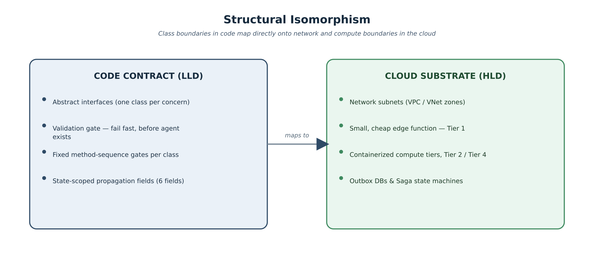
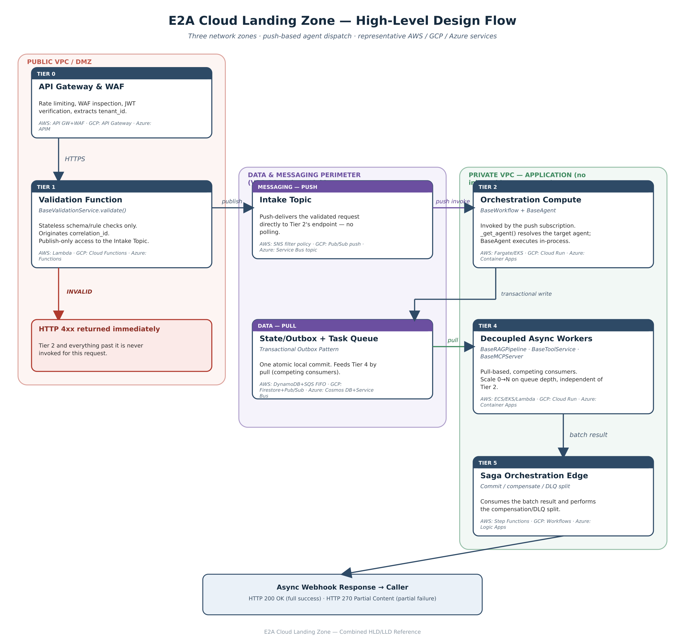
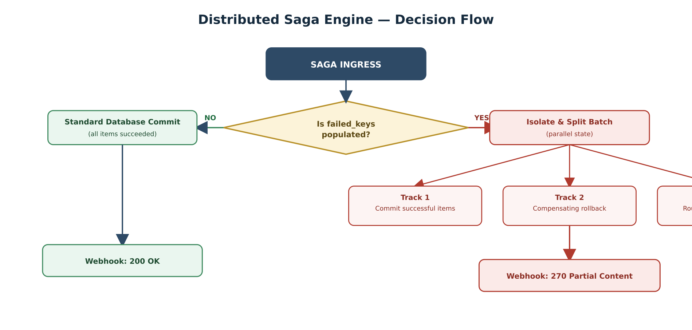
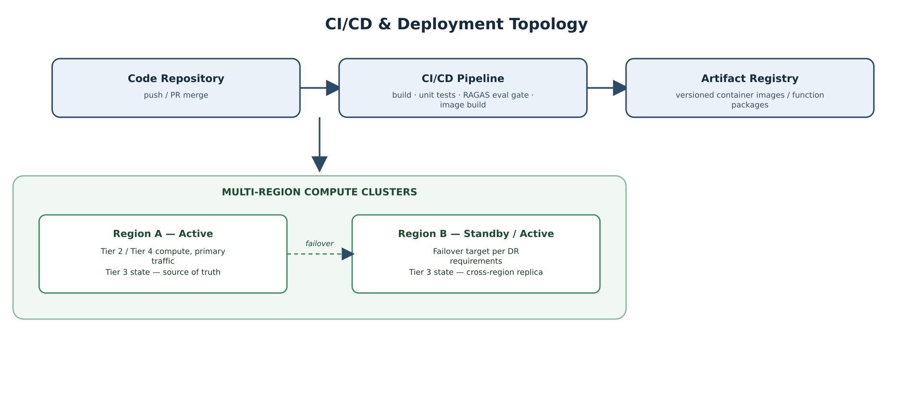
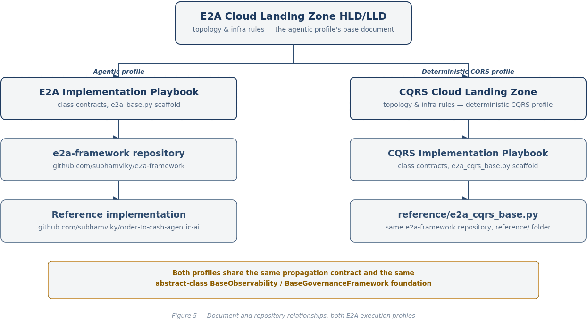

# E2A Cloud Landing Zone

### Combined High-Level Design (HLD) & Low-Level Design (LLD) Reference

*Vendor-neutral cloud topology for the Enterprise-to-Agentic (E2A) Framework, with an AWS reference implementation*

|  |  |
| --- | --- |
| Document Version | 1.0.0 |
| Author | Subham Gupta, Principal Platform Architect |
| Classification | Architecture Reference — Cloud Infrastructure |
| Companion document | E2A Implementation Playbook — defines the class contracts and scaffold code this document deploys. This document does not repeat method signatures or Python code; see the Playbook for those. |
| Scope | This document is infrastructure- and topology-focused: network zones, compute tiers, data/messaging substrate, Saga orchestration, resiliency patterns, NFR sizing, and vendor mapping across AWS/GCP/Azure. |


# 1. Executive Strategy & Architectural Philosophy


The E2A (Enterprise-to-Agentic) Framework addresses the largest practical obstacle to enterprise AI adoption: the absence of design-time architectural guardrails in probabilistic AI systems. The operating thesis is Structural Isomorphism — the class boundaries, validation gates, and propagation fields defined in code (the LLD) map directly onto network enclaves, compute tiers, and event-driven state machines in the cloud substrate (the HLD). Nothing in the infrastructure layer should require a concept that doesn't already exist as a class contract, and nothing in the class contracts should assume an infrastructure shape it can't actually get.



*Figure 1 — Structural Isomorphism between the LLD class contract and the HLD cloud substrate*

Because application-level state (correlation_id, tenant_id, idempotency_key) is decoupled from any specific cloud vendor's transport mechanics, the same class contracts deploy onto AWS, GCP, or Azure without changing business logic — only the vendor mapping in Section 6 changes.

> **Relationship to the Implementation Playbook**
>
> This document answers where each class runs and how the pieces are wired at the infrastructure level. The Implementation Playbook answers what each class's methods do and ships the runnable scaffold code. Read them together: a change to a class contract (e.g. adding BaseValidationService) is authored once in the Playbook and reflected here as a topology change — Section 3 in this document exists because of Section 2.2 in the Playbook, not independently of it.


# 2. Low-Level Design (LLD) Summary


Full method signatures, config/kwargs tables, and the runnable scaffold live in the Implementation Playbook. This section carries only what the infrastructure design in Sections 3-9 depends on: the entry-point rule, the propagation contract, and a one-line purpose per class.


## 2.1 The Single Public Entry Point Rule


Every class has exactly one public entry point. All protected/private methods run in a fixed, framework-owned sequence; a subclass overrides only the hooks relevant to its domain.

| Class | Public entry point |
| --- | --- |
| BaseValidationService | validate(agent_name, state, config=None, **kwargs) -> ValidationResult |
| BaseWorkflow | execute(state, config=None, **kwargs) -> dict |
| BaseAgent | run(state, config=None, **kwargs) -> dict |
| BaseRAGPipeline | retrieve(query, config=None, tenant_id=None, **kwargs) -> list[dict] |
| BaseToolService | async execute(payload, config=None, tenant_id=None, **kwargs) -> dict |
| BaseMCPServer | serve(request, config=None, **kwargs) -> dict |


## 2.2 Cross-Class Propagation Fields


None of the six operational fields below are stored as class-level (self.) attributes — a shared instance reused across concurrent requests (the normal case behind FastAPI/Lambda/Cloud Run) would corrupt logs and failure data across requests if they were. All six are created fresh at the top of the request chain and passed as explicit parameters down the call stack.

| Field | Direction | Origin (current) | Purpose |
| --- | --- | --- | --- |
| correlation_id | INPUT | BaseValidationService.validate() — the earliest point in the chain, ahead of BaseWorkflow | Ties every log line, metric, and trace across every tier back to one logical transaction. |
| tenant_id | INPUT | Extracted from the JWT claim at the API Gateway, carried through validation | Enforces hard data-isolation filters down to vector indexes, database shards, and tool/MCP endpoints. |
| idempotency_key | INPUT | Intercepted or minted in BaseWorkflow.execute() | Prevents double-execution in down-stack database sinks and tool calls. |
| io_config | INPUT | Resolved in BaseWorkflow.execute() from the IO_CONFIG namespace | Separates connection/endpoint configuration from behavioral NFR configuration. |
| message_log | OUTPUT | Empty list at request start; every class appends structured entries | One ordered, structured log per request, flushed once at the end instead of scattered per-tier lines. |
| failed_keys | OUTPUT | Empty list at request start; any _handle_error() appends the failing key | Drives the commit gate and the Saga engine's compensation/DLQ split (Section 7). |


## 2.3 Class Purpose Summary


| Class | NFR Purpose |
| --- | --- |
| BaseValidationService | Fail-fast gate. Runs before any other class is instantiated. Resolves a per-agent validator, returns a structured pass/fail result, and originates correlation_id. On failure, nothing downstream is invoked. |
| BaseWorkflow | Origin and lifecycle manager of the session state below the validation gate. Resolves io_config/idempotency_key, builds the routing graph, invokes the target agent, flushes logs on exit. |
| BaseAgent | Executes the agentic decision loop (build messages → apply policy → LLM call → evaluate output). No longer self-validates — see BaseValidationService. Exceptions are intercepted and converted into failed_keys entries rather than raised past the workflow boundary. |
| BaseRAGPipeline | Performs semantic search. Vector search calls are programmatically namespaced by tenant_id so one tenant can never retrieve another tenant's documents. |
| BaseToolService | Client-side interface to external REST APIs or local/external MCP servers. Runs a commit gate immediately before execution: if the item's key is already in failed_keys, execution is blocked while sibling items proceed. |
| BaseMCPServer | Server-side counterpart to BaseToolService — wraps existing tool implementations as Model Context Protocol endpoints (tools/list, tools/call) without altering their original transport configuration. |


# 3. High-Level Design (HLD): Cloud Landing Zone Substrate


The topology below is vendor-neutral by design — component names describe function, not a specific managed service. Section 6 maps each generic component onto AWS, GCP, and Azure; Appendix A carries a full AWS reference implementation for teams that want one concrete, deployable starting point.

Three network zones are used, not tiers alone — a tier is a processing stage; a zone is a security boundary, and more than one tier can share a zone. Getting this mapping right matters more than the tier count: compute that executes business logic and data stores that hold tenant state have different exposure requirements even when they sit next to each other in the request flow.

| Zone | Contains | Trust boundary |
| --- | --- | --- |
| Public VPC / DMZ | Tier 0 (API Gateway & WAF), Tier 1 (Validation Function) | The only zone with a direct internet route. Holds no tenant data and runs no business logic — schema/rule checks only. |
| Data & Messaging Perimeter | State/Outbox DB, Intake Topic, Task Queue (all of Tier 3's components) | No direct route from the Public VPC or the internet. Reachable only from inside the perimeter via private connectivity (VPC Service Controls / PrivateLink / Private Link, depending on cloud) — this is a data-exfiltration control, stricter than a private subnet alone. |
| Private VPC (Application) | Tier 2 (BaseWorkflow + BaseAgent), Tier 4 (RAG/Tool/MCP workers), Tier 5 (Saga Edge) | No inbound route from the internet. Outbound access to LLM providers and external tool APIs via NAT/egress; inbound access only from the Data & Messaging Perimeter's push/pull delivery. |



*Figure 2 — Full HLD request flow across the three network zones, with representative AWS / GCP / Azure components per stage*


## 3.1 Tier 0 — API Gateway and Edge Security (Public VPC)


- Generic component: managed API Gateway + WAF.

- A WAF layer inspects for injection attacks, XSS, and request surges ahead of any application code.

- The gateway extracts the cryptographically verified tenant_id from the JWT claim and maps it into the request payload — tenant_id is never trusted from an unauthenticated request body.


## 3.2 Tier 1 — Validation Function (Public VPC)


- Generic component: a serverless function (Lambda / Cloud Function / Cloud Run Function), deliberately not the same compute tier as Tier 2.

- Runs BaseValidationService.validate(): schema and business-rule checks only — no LLM calls, no vector search, no downstream HTTP calls, so the tier is cheap and fast by construction.

- On failure, returns a 4xx with the ValidationResult body and stops. Tier 2 compute is never started for that request — this is the cost and latency control this tier exists for.

- On success, publishes the validated request to the Intake Topic (Section 3.3) rather than calling Tier 2 directly. Tier 1 is granted a narrow, publish-only access level into the Data & Messaging Perimeter for this one topic — it does not get broad read/write access to the state store, and it never queries the Task Queue or database.

- Tier 0 returns HTTP 202 Accepted to the caller as soon as this publish succeeds (Section 10.1) — the synchronous portion of the request ends here.


## 3.3 Data & Messaging Perimeter


This is the corrected placement from the network-placement question this design went through: the state database, the outbox, and both message queues (Intake Topic and Task Queue) sit together in one hardened perimeter, not a generic private subnet. The distinction matters — a private subnet keeps traffic off the public internet, but a service perimeter (GCP: VPC Service Controls; AWS: PrivateLink endpoints + resource policies + Service Control Policies; Azure: Private Link + Azure Policy) additionally blocks access from outside the trust boundary even if valid credentials are presented, which is the control that matters most for the data stores specifically.

- Intake Topic: receives the validated, correlation_id-tagged request from Tier 1. Delivery is push, not pull — the broker invokes Tier 2's endpoint directly (SNS→Lambda-style invoke, Pub/Sub push subscription, or Service Bus topic subscription) as soon as a message arrives, instead of Tier 2 polling for work. This removes polling latency and lets Tier 2 scale on invocation count rather than on a poll loop.

- State / Outbox Table + Task Queue: Tier 2 performs one atomic local commit here (Transactional Outbox Pattern) containing both the operational state write and the outbound event for Tier 4, preventing dual-write bugs between the database and the queue.

- Private VPC compute (Tier 2, Tier 4, Tier 5) is granted broader intra-perimeter access — read/write to the state table, publish/subscribe on both queues — appropriate to a trusted zone, which is a wider grant than Tier 1's publish-only access above.


## 3.4 Tier 2 — Orchestration Compute (BaseWorkflow + BaseAgent) — Private VPC


> **Correcting a placement question**
>
> Tier 2 belongs in the Private VPC, not the Public VPC. It executes business logic and, through BaseAgent, calls out to LLM providers and (via tool routing) tenant systems — that is exactly the compute a direct internet route would expose unnecessarily. Public VPC is reserved for Tier 0/1, which hold no tenant data and run no business logic beyond schema checks. Tier 2 is invoked only by the Intake Topic's push delivery, never by a direct internet request — its only inbound path is from inside the Data & Messaging Perimeter, and its only outbound paths are to LLM providers, tool endpoints, and back into the perimeter to write the outbox.

- Generic component: containerized compute in the private application subnet (Fargate, Cloud Run, or Container Apps), with outbound-only internet access via NAT/egress for LLM and tool calls.

- Invocation: the Intake Topic's push subscription target is BaseWorkflow. On invocation, BaseWorkflow._get_agent() resolves which BaseAgent subclass handles the message's intent — this identification step is application code, not something the message broker itself performs; the broker's job is content-based push delivery of already-validated messages, not semantic classification.

- BaseWorkflow and BaseAgent are co-located in the same container/task once invoked. Because they communicate continuously in-process from that point on, a network hop between them would add latency for no isolation benefit — the isolation boundary that matters (fail-fast without paying for this tier at all) is the Tier 1 / Tier 2 split, already enforced by the Intake Topic sitting between them.


## 3.5 Tier 4 — Decoupled Asynchronous Workers (Private VPC)


- Generic component: containerized or serverless workers in the private application subnet, consuming from the Task Queue.

- Delivery here is intentionally pull-based (competing consumers), unlike the Intake Topic's push delivery to Tier 2: Tier 4 is a pool of interchangeable workers handling generic RAG/tool/MCP tasks with no single named target, so elastic queue-depth-based autoscaling (KEDA-style, workers scale to match backlog) is the better fit. Push makes sense where there is one specific, resolved destination (Tier 2's BaseWorkflow instance for a given intent); pull makes sense where any available worker in a pool can take the next item.

- Hosts BaseRAGPipeline, BaseToolService, and BaseMCPServer. These three scale independently of Tier 2 and of each other where deployed as separate services (see the Playbook's Section 2.10 guidance on when to split a class into more than one microservice).

- BaseMCPServer placement: it wraps existing BaseToolService implementations, so it deploys alongside the BaseToolService workers it wraps — not as a separate network zone. Treat it as another worker in Tier 4 whose inbound traffic is tools/list and tools/call JSON-RPC calls rather than the outbound REST calls BaseToolService itself makes.

- Elastic 0→N scaling based on queue length and consumer lag, not fixed capacity — idle cost approaches zero during low-traffic windows.


## 3.6 Tier 5 — Saga Orchestration Edge (Private VPC)


- Generic component: a managed state-machine service (e.g. Step Functions / Workflows / Logic Apps).

- Consumes the batch result payload (correlation_id, processed items, failed_keys) and performs the commit/rollback/DLQ split described in Section 7.


# 4. Network Placement Reasoning


| Zone | Placement | Purpose | Reasoning |
| --- | --- | --- | --- |
| Public VPC / DMZ | Tier 0 (API Gateway/WAF), Tier 1 (Validation Function) | Entry point and fail-fast gate for external requests | Both need to be internet-reachable; neither touches tenant data at rest nor runs business logic, so exposure risk is bounded. Tier 1 gets a narrow, publish-only grant into the Data & Messaging Perimeter — nothing broader. |
| Data & Messaging Perimeter | Intake Topic, State/Outbox Table, Task Queue (Tier 3) | Hardened boundary around every tenant-data-bearing and message-bearing component | No route from the Public VPC or the internet at all — access is granted per-service-account/role to specific zones, not opened by network path. This is what actually stops data exfiltration even if a Public VPC credential were compromised. |
| Private VPC (Application) | Tier 2 (Orchestration Compute), Tier 4 (Async Workers), Tier 5 (Saga Edge) | Executes business logic, calls LLM providers and tool endpoints, and reads/writes the data perimeter | No public route; invoked only via push/pull delivery from the Data & Messaging Perimeter — this is the correction from treating Tier 2 as reachable directly, which would bypass Tier 0/1's rate limiting and validation gate. |
| Hybrid / flexible | Optional managed DB/queue exposure for cost-sensitive, non-regulated tenants | Startup-friendly cost optimization | Trades some perimeter strictness for lower operating cost where the tenant's regulatory profile allows it — see Section 10.2 Pool vs. Silo |


# 5. E2A Class to Cloud Component Integration


| E2A Class / Concept | Cloud Component | Function |
| --- | --- | --- |
| BaseValidationService | Validation Function (Tier 1, Public VPC) | Pre-checks and fail-fast gate; originates correlation_id; publishes to the Intake Topic only on success |
| Intake Topic / Router | Data & Messaging Perimeter (Tier 3) | Push-delivers the validated request directly to Tier 2 — content-routed delivery, not polled |
| BaseWorkflow | Orchestration Compute (Tier 2, Private VPC) | Invoked by the Intake Topic's push subscription; resolves the target agent via _get_agent(); propagates io_config, idempotency_key, message_log, failed_keys |
| BaseAgent | Orchestration Compute (Tier 2, Private VPC) | Parses intent, applies policy, triggers tool/MCP calls via tool-call routing |
| BaseRAGPipeline | Retrieval Worker (Tier 4, Private VPC) | Tenant-scoped context retrieval |
| BaseToolService | Tool Worker (Tier 4, Private VPC) | Executes REST or MCP-client tool logic |
| BaseMCPServer | MCP Worker (Tier 4, Private VPC, colocated with wrapped tools) | Exposes wrapped tools over JSON-RPC (tools/list, tools/call) |
| Outbox / DLQ | Data & Messaging Perimeter (Tier 3) | Transactional write buffer and dead-letter capture for failed_keys |
| Saga / Compensation | Saga Orchestration Edge (Tier 5, Private VPC) | Commit/rollback split, compensating transactions |
| Observability | Logging, metrics, and tracing stack, cross-cutting | Collects telemetry from every tier, correlated by correlation_id |


# 6. Vendor-Specific Cloud Component Mapping


Generic component names are the primary reference throughout this document; the table below is the only place vendor-specific service names appear in the main body. A fuller AWS-specific reference implementation, including the complete Step Functions state machine definition, is in Appendix A.

| Generic Component | AWS | GCP | Azure |
| --- | --- | --- | --- |
| API Gateway | Amazon API Gateway + WAF | Cloud Endpoints / API Gateway | Azure API Management |
| Validation Function | AWS Lambda | Cloud Functions / Cloud Run | Azure Functions |
| Orchestration Compute | ECS Fargate / EKS | Cloud Run / Workflows | Azure Container Apps / Logic Apps |
| Tool / RAG / MCP Workers | ECS / EKS / Lambda | Cloud Run | Azure Container Apps |
| Retrieval / Vector Index | OpenSearch / Bedrock Knowledge Bases | Vertex AI Search / Cloud AI Embeddings | Azure AI Search |
| NoSQL State DB | DynamoDB | Firestore / Bigtable | Cosmos DB |
| Intake Topic (push routing) | SNS (filter policies) → Lambda/Fargate invoke | Pub/Sub push subscription | Service Bus topic + subscription rules |
| Pub/Sub Task Queue (pull) | SQS FIFO | Pub/Sub (pull) | Service Bus queue |
| Dead Letter Queue | SQS DLQ | Pub/Sub DLQ | Service Bus DLQ |
| Saga / Compensation Processor | Step Functions / Lambda | Workflows / Cloud Functions | Logic Apps / Functions |
| Outbox Janitor | Scheduled Lambda (EventBridge) | Cloud Scheduler + Cloud Function | Logic Apps + Functions |
| Observability Stack | CloudWatch + X-Ray | Cloud Monitoring + Cloud Trace | Azure Monitor + App Insights |
| Logging & Tracing | CloudWatch Logs / OpenTelemetry | Cloud Logging / OpenTelemetry | Log Analytics / OpenTelemetry |


# 7. The Distributed Saga Engine


When Tier 4 workers finish their asynchronous work, the batch result (correlation_id, processed items, accumulated failed_keys) triggers the Saga Orchestration Edge (Tier 5). Its job is Granular Save Prevention and Automated Compensation: isolate failures and run targeted rollbacks out-of-band before any record reaches a final storage sink, so a batch containing some failures does not block the items that succeeded.



*Figure 3 — Distributed Saga engine decision flow: commit, compensate, or route to DLQ*

The AWS reference implementation expresses this exact branching as an Amazon States Language (ASL) state machine — a Choice state on failed_keys presence, feeding a Parallel state with per-track Map iterations. The complete, deployable ASL definition is in Appendix A; it is intentionally not repeated here so this section stays vendor-neutral and readable.


# 8. Mathematical NFR Verification


Baseline system footprint, used to size every tier above:

| Metric | Value |
| --- | --- |
| Daily active tenants (DAU) | 20,000 developers/systems |
| Average transactions per active tenant per day (T) | 5,000 operations |
| Total daily ingestion load (L_day) | 20,000 × 5,000 = 100,000,000 operations/day |


## 8.1 System Throughput Requirements


| Metric | Derivation | Result |
| --- | --- | --- |
| Average ingress throughput | 100,000,000 ÷ 86,400 seconds | ≈ 1,157.4 RPS |
| Peak hour surge coefficient | assumed | 3.0× |
| Design peak capacity | 1,157.4 × 3.0 | ≈ 3,472.2 RPS |


## 8.2 Compute Elasticity (Queue-Depth Scaling)


With each container task handling 50 concurrent requests safely under CPU constraints, and a target queue lag of 50 messages/pod: at a peak queue depth of 15,000 pending messages, required active pods = ceil(15,000 / 50) = 300 tasks.


## 8.3 Latency Budget Allocation


Total end-to-end processing SLA: ≤ 60 seconds. Only the first row is on the caller's synchronous connection (Tier 0 returns 202 Accepted once Tier 1 publishes to the Intake Topic); everything from the push-invoke of Tier 2 onward happens after the connection has already been released, reported back via the async webhook in Section 10.1.

| Stage | Budget |
| --- | --- |
| Tier 0/1 — Ingress validation, correlation/idempotency key minting, publish to Intake Topic (synchronous, on the caller's connection) | 0.5 s |
| Tier 2 — Push-invoke + generation compute execution (asynchronous) | 30.0 s |
| Tier 2 — Policy / compliance evaluation (asynchronous) | 15.0 s |
| Tier 3/5 — Parallel Saga write + commit (asynchronous) | 14.5 s |


## 8.4 Storage Footprint (30-Day Ingestion Archive)


With an average raw JSON payload of 1.5 KB: monthly ingestion = 100,000,000 ops/day × 1.5 KB × 30 days = 4.5 TB. Applying a 3× replication factor plus 30% metadata indexing overhead: total monthly storage overhead ≈ 4.5 TB × 3 × 1.3 ≈ 17.55 TB.


# 9. CI/CD & Deployment Topology


Deployment topology sits above the runtime tiers in Sections 3-4: it describes how code reaches those tiers and how the platform survives a regional failure.



*Figure 4 — CI/CD pipeline and multi-region deployment topology*


## 9.1 Pipeline Stages


- Build & unit test: standard per-class unit tests against the Playbook's scaffold contracts (each class's protected hooks are independently testable without the full chain).

- RAG evaluation gate: BasePipeline._run_rag_eval() (Playbook Section 2.9, Foundation Classes) blocks promotion if faithfulness/groundedness drops below threshold.

- Container image build and push to a versioned artifact registry — one image per E2A class family (validation, orchestration, RAG worker, tool worker, MCP worker) so each can be deployed and rolled back independently.

- Multi-region rollout: Tier 2 and Tier 4 compute deploy to at least two regions; Tier 3 state uses cross-region replication appropriate to the Pool/Silo model in effect for a given tenant (Section 10.2).


## 9.2 Scaling and Resilience at the Deployment Layer


- Tier 1 and Tier 4 scale automatically on request volume / queue depth respectively — no manual capacity planning per deploy.

- Tier 2 scales on concurrent request count with a floor sized to the p50 traffic pattern, avoiding cold-start latency on the synchronous path.

- Multi-region clusters exist for disaster recovery, not routine load distribution — routing between regions is a failover concern, handled at Tier 0.


# 10. Enterprise Safeguards & Resiliency Patterns


## 10.1 Request-Reply Webhook Status Mapping


Vulnerability: returning HTTP 200 for a payload containing partial failures causes downstream callers to miss inner data corruption; synchronous waiting also risks gateway timeouts.

Mitigation — Asynchronous Request-Reply Pattern: Tier 0 acknowledges valid requests with HTTP 202 Accepted and the correlation_id under a p99 < 200 ms SLO, releasing the connection immediately. When the Saga (Tier 5) completes, an outbound webhook reports the outcome: HTTP 200 OK if failed_keys is empty, or a custom HTTP 270 Partial Content if not — forcing the caller to explicitly handle partial failure rather than silently treating 200 as "fully succeeded."


## 10.2 Multi-Tenant Storage Partitioning (Pool vs. Silo)


Vulnerability: co-mingling high-velocity, low-regulation tenant data with strict FSI/regulated tenant data in the same physical table risks compliance audit failure.

- Pool Model (standard tenants): logical isolation. Shared tables, strict partition-key routing enforced on every query — PartitionKey = TENANT#<tenant_id>, SortKey = ITEM#<item_key>.

- Silo Model (FSI/regulated tenants): physical isolation. The storage driver interceptor reads tenant_id and routes the connection to an entirely separate database instance or account.


## 10.3 Outbox Janitor & CDC Sync


Vulnerability: a compute node crashing after the outbox write but before the queue publish drops the transaction. Mitigation: a scheduled Outbox Janitor runs every 60 seconds, scans for records stuck PENDING for over 120 seconds, and safely republishes them — guaranteeing at-least-once delivery.


## 10.4 Poison Pill Isolation Gate


Vulnerability: a malformed item that passes schema validation but crashes a Tier 4 worker on every retry can clog an entire FIFO queue partition. Mitigation: a Redrive Policy on the queue intercepts any message whose receive count exceeds 3 and routes it directly to the DLQ, preventing pipeline-wide stalls from a single bad item.


# 11. Additional Considerations


| Dimension | Approach |
| --- | --- |
| Security | IAM roles / service accounts scoped per tier; VPC Service Controls or equivalent for tenant isolation; secrets never in code or environment plaintext |
| Scalability | Autoscaling on Tier 2 (request concurrency) and Tier 4 (queue depth); Tier 1 scales inherently as serverless |
| Resilience | Circuit breakers and retries with jitter (BaseGovernanceFramework, Playbook Section 2.9); DLQ isolation; Saga compensation |
| Cost Optimization | Serverless Tier 1 avoids paying for Tier 2 compute on invalid requests; Tier 4 scales to zero; managed messaging over self-hosted |
| Compliance | Encryption at rest and in transit; audit logging keyed by correlation_id; tenant-scoped data segregation per Section 10.2 |


# 12. Related Documents


This document and its companions form the reference set for implementing and deploying the E2A Framework:



*Figure 5 — Document and repository relationships*

Two related deep-dive references — a financial/transaction-safety idempotent billing ledger design, and a container-vs-Kubernetes compute decision matrix — are tracked as separate documents outside this reference set and are not included here.


---


# Appendix A — AWS Reference Implementation


A concrete, deployable starting point for teams standardizing on AWS. Everything in this appendix is one specific vendor mapping of Sections 3-7; nothing here is required to implement E2A on another cloud.


## A.1 AWS Component Mapping


See Section 6 for the full AWS/GCP/Azure table. On AWS specifically: Tier 0 is API Gateway + WAF; Tier 1 is a Lambda function with a publish-only IAM policy onto the Intake Topic; the Data & Messaging Perimeter (Tier 3) is an SNS Intake Topic with filter policies, DynamoDB for state/outbox, and SQS FIFO as the Task Queue, all behind PrivateLink endpoints and resource policies; Tier 2 is one or more ECS Fargate tasks (BaseWorkflow + BaseAgent co-located per Section 3.4) invoked via the SNS→Lambda/Fargate push integration; Tier 4 is ECS/EKS tasks in the private application subnet scaling via KEDA on SQS queue depth; Tier 5 is a Step Functions state machine.


## A.2 Step Functions Saga — State Machine Skeleton


The full production ASL definition (all Map/Parallel branches, retry/catch blocks, and DynamoDB/SQS resource ARNs) lives in the e2a-base repository's infra/ directory, versioned alongside the Terraform/CDK that provisions it. The skeleton below shows the branching structure described narratively in Section 7:

```json
{
  "Comment": "E2A Distributed Saga Orchestrator & Save Prevention Engine",
  "StartAt": "EvaluateFailedKeys",
  "States": {
    "EvaluateFailedKeys": {
      "Type": "Choice",
      "Choices": [
        { "Variable": "$.failed_keys[0]", "IsPresent": true, "Next": "IsolateAndSplitBatch" }
      ],
      "Default": "StandardDatabaseCommit"
    },
    "StandardDatabaseCommit": {
      "Type": "Task",
      "Resource": "arn:aws:states:::dynamodb:putItem",
      "Parameters": {
        "TableName": "E2APersistenceTable",
        "Item": {
          "transaction_id": { "S.$": "$.correlation_id" },
          "tenant_id": { "S.$": "$.tenant_id" },
          "records": { "S.$": "$.processed_items" }
        }
      },
      "Next": "DispatchFinalWebhook"
    },
    "IsolateAndSplitBatch": {
      "Type": "Parallel",
      "Branches": [
        { "StartAt": "CommitSuccessfulItems", "States": { "...": "..." } },
        { "StartAt": "RunCompensatingRollback", "States": { "...": "..." } },
        { "StartAt": "RouteToDLQ", "States": { "...": "..." } }
      ],
      "Next": "DispatchFinalWebhook"
    },
    "DispatchFinalWebhook": {
      "Type": "Task",
      "Resource": "arn:aws:states:::apigateway:invoke",
      "End": true
    }
  }
}
```

*E2A Cloud Landing Zone — Combined HLD/LLD Reference · Subham Gupta, Principal Platform Architect*
