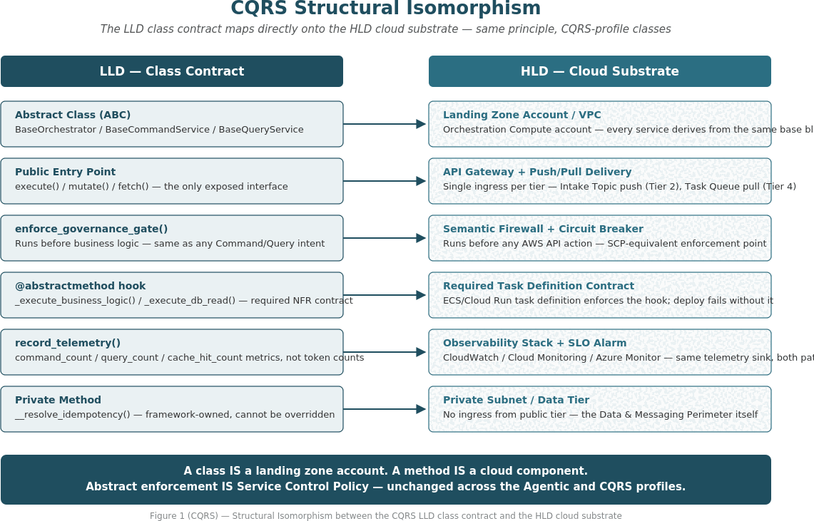
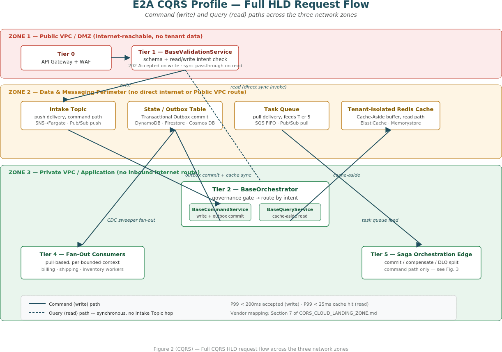
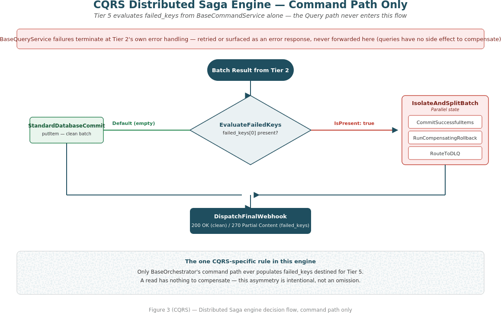

# E2A CQRS Cloud Landing Zone

### Combined High-Level Design (HLD) Reference — Deterministic CQRS Profile

*Vendor-neutral cloud topology for the E2A Deterministic CQRS Profile — a companion execution profile of the Enterprise-to-Agentic (E2A) Framework for cloud-native microservices that need sub-second, schema-strict, highly concurrent request handling and do not require LLM reasoning on the request path.*

| | |
|---|---|
| Document Version | 1.0.0 |
| Author | Subham Gupta, Principal Platform Architect |
| Classification | Architecture Reference — Cloud Infrastructure, Deterministic CQRS Profile |
| Companion document | [CQRS_IMPLEMENTATION_PLAYBOOK.md](CQRS_IMPLEMENTATION_PLAYBOOK.md) — class contracts and full scaffold source (`reference/e2a_cqrs_base.py`) this document deploys. This document does not repeat method signatures or Python code; see the Playbook for those. |
| Parent reference | [CLOUD_LANDING_ZONE.md](CLOUD_LANDING_ZONE.md) — the agentic profile this document is a companion to, not a replacement for |
| Scope | Infrastructure- and topology-focused: network zones, compute tiers, CQRS data substrate, Saga orchestration, resiliency patterns, NFR sizing, and vendor mapping across AWS/GCP/Azure. |

## 1. Executive Summary & Positioning

This document specifies the High-Level Design for the E2A Deterministic CQRS Profile. It is a profile of E2A, not a fork — it preserves the framework's three network zones, six-tier numbering, and the six cross-class propagation fields defined in [CLOUD_LANDING_ZONE.md](CLOUD_LANDING_ZONE.md), and it reuses `BaseValidationService` unmodified. `BaseObservability` and `BaseGovernanceFramework` are reused as the same abstract-class (`ABC`) contract but with CQRS-adapted hooks — see Section 8 and the Playbook's Section 4. Only the Tier 2 orchestration layer changes: `BaseWorkflow` and `BaseAgent` are replaced by `BaseOrchestrator`, `BaseCommandService`, and `BaseQueryService`.

The operating thesis is unchanged — **Structural Isomorphism**, where class boundaries and propagation contracts defined in code map directly onto network zones and compute tiers in the cloud substrate. What changes in this profile is the shape of Tier 2's internal routing (Command/Query instead of Workflow/Agent) and the removal of LLM-specific concerns (prompt assembly, context caching, semantic routing between agents) from the request path.

*Figure 1 (CQRS) — Structural Isomorphism between the CQRS LLD class contract and the HLD cloud substrate*

> **Relationship to the companion documents**
>
> This HLD answers where each CQRS class runs and how the pieces are wired at the infrastructure level. [CQRS_IMPLEMENTATION_PLAYBOOK.md](CQRS_IMPLEMENTATION_PLAYBOOK.md) answers what each class's methods do and carries the corrected, runnable scaffold code. Read them together — Section 3 here exists because of Section 4 in the Playbook, not independently of it.

## 2. Review Findings: Corrections Applied From the Initial CQRS Draft

An initial CQRS mapping draft was circulated ahead of this document. It correctly identified the core substitution (`BaseOrchestrator` for `BaseWorkflow`, `BaseCommandService`/`BaseQueryService` for `BaseAgent`) and the Cache-Aside and Transactional Outbox mechanics. Re-evaluating it against the actual E2A base scaffold and [CLOUD_LANDING_ZONE.md](CLOUD_LANDING_ZONE.md) surfaced gaps corrected in this document and its Playbook companion:

- **Observability and Governance were dropped, not adapted.** The draft's `BaseOrchestrator` finally-block only flushed logs locally — it never called an observability engine, and no governance gate ran on either path. This profile reinstates both as abstract-class contracts (Section 8) with the same injection points the agentic profile uses, since payload-injection and PII exposure risk do not disappear just because there is no LLM call.
- **Tier 4 was silently removed, breaking the tier-numbering isomorphism.** The draft jumped from Tier 3 (messaging/cache) straight to "Tier 5" Saga orchestration. This profile keeps Tier 4 as the home for domain-event fan-out consumers — pull-based, horizontally scaled, structurally the same role Tier 4 plays in the agentic profile.
- **The propagation contract used a method name that does not exist in the base scaffold.** The draft's sample code called a non-existent `_resolve_idempotency()` mixin helper. The Playbook corrects this so the CQRS scaffold's propagation code is drop-in consistent with `e2a_base.py`.
- **Zone naming drifted from the established taxonomy.** The draft's "ZONE 1/2/3" labels do not correspond to [CLOUD_LANDING_ZONE.md](CLOUD_LANDING_ZONE.md)'s Public VPC/DMZ, Data & Messaging Perimeter, and Private VPC (Application) zone names. This document reuses the established names.
- **DLQ/Saga exclusion for the read path was correct but unstated as a design decision.** This document keeps that behavior and states the reasoning explicitly (Section 6).
- **The vendor mapping table covered AWS and GCP only.** Section 7 extends it to include Azure and the Observability/Governance components, matching [CLOUD_LANDING_ZONE.md](CLOUD_LANDING_ZONE.md)'s Section 6 depth.

## 3. High-Level Design: Cloud Landing Zone Substrate

The topology reuses the three network zones and six compute tiers from [CLOUD_LANDING_ZONE.md](CLOUD_LANDING_ZONE.md). Tier numbers are load-bearing identifiers shared across both HLDs and both LLDs/Playbooks — do not renumber a tier when adapting the profile further.

*Figure 2 (CQRS) — Full CQRS HLD request flow across the three network zones, Command and Query paths*

### 3.1 Zones and Trust Boundaries

| Zone | Contains | Trust Boundary |
|---|---|---|
| Public VPC / DMZ | Tier 0 (API Gateway & WAF), Tier 1 (Validation Function) | Only zone with a direct internet route. No tenant data at rest, no business logic — schema/intent checks only. |
| Data & Messaging Perimeter | Tier 3: State/Outbox Table, Intake Topic, Task Queue, Tenant-Isolated Redis Cache | No direct route from the Public VPC or the internet. Reachable only from inside the perimeter via private connectivity. |
| Private VPC (Application) | Tier 2 (`BaseOrchestrator` + Command/Query Services), Tier 4 (Fan-Out Event Consumers), Tier 5 (Saga Edge) | No inbound route from the internet. Inbound only via push (Tier 2) or pull (Tier 4) delivery; outbound to downstream APIs and read replicas via NAT/egress. |

### 3.2 Tier-by-Tier Design

**Tier 0 — API Gateway & WAF (Public VPC).** JWT verification, route inspection, rate limiting. Extracts the cryptographically verified `tenant_id` from the JWT claim.

**Tier 1 — Validation Service (Public VPC).** Runs `BaseValidationService.validate()` unmodified: schema and business-rule checks, intent classification (read or write?), `correlation_id` origination. On success, either publishes to the Tier 3 Intake Topic (Command intents) or allows a direct synchronous invoke of Tier 2 (Query intents).

**Tier 2 — Orchestration Compute (Private VPC).** Hosts `BaseOrchestrator`, which replaces `BaseWorkflow`, and the Command/Query service implementations, which replace `BaseAgent`. `BaseOrchestrator` resolves `io_config` and `idempotency_key`, runs the Governance gate, routes to the matching service, and — in its `finally` block — hands `message_log` to the Observability engine and, for the command path only, `failed_keys` to the DLQ.

**Tier 3 — Data & Messaging Perimeter.** Four components: the Intake Topic (push delivery into Tier 2 for commands), the State/Outbox Table (Transactional Outbox), the Task Queue (feeds Tier 5), and the Tenant-Isolated Redis Cache (Cache-Aside buffer for the read path).

**Tier 4 — Domain Event Fan-Out Consumers (Private VPC).** Restored in this profile to preserve tier-numbering isomorphism with the agentic HLD. When `BaseCommandService` completes an outbox commit, the CDC sweeper emits the event onto a Pub/Sub Fan-Out topic. Tier 4 hosts the pool of pull-based, horizontally autoscaled consumers — one per bounded context (billing, shipping, inventory).

**Tier 5 — Saga Orchestration Edge (Private VPC).** Unchanged from the base framework. Consumes the batch result from the command path only.

### 3.3 Sequence — Write Path (Command)

1. Tier 0/1: HTTP POST validated; `correlation_id` minted; HTTP 202 returned.
2. Tier 1 → Tier 3: validated payload published to the Intake Topic.
3. Tier 3 → Tier 2: push-invoke of `BaseOrchestrator`, routed to the matching `BaseCommandService`.
4. Tier 2: DTO validation → Governance gate → business logic → atomic Outbox commit → synchronous cache invalidation (`_synchronize_cache`).
5. Tier 3 → Tier 4: CDC sweeper fans the committed event out to domain-event consumers.
6. Tier 3 → Tier 5: Task Queue feeds the Saga edge, which evaluates `failed_keys` and performs commit, compensate, or DLQ routing.

### 3.4 Sequence — Read Path (Query)

1. Tier 0/1: HTTP GET validated instantly, no Intake Topic hop.
2. Tier 1 → Tier 2: direct synchronous gRPC/HTTP invoke of `BaseOrchestrator`, routed to the matching `BaseQueryService`.
3. Tier 2 → Tier 3: cache-aside lookup against Redis. On hit, response is marshaled directly into the output DTO — no Tier 3 database or Tier 5 involvement.
4. Tier 2 → Tier 3 (Read Replica): on cache miss only, a locked read against a physical read-only replica, followed by a cache hydrate.

## 4. Network Placement Reasoning

| Zone | Placement | Reasoning |
|---|---|---|
| Public VPC / DMZ | Tier 0, Tier 1 | Internet-reachable; holds no tenant data at rest and runs no business logic, so exposure risk is bounded regardless of read/write intent. |
| Data & Messaging Perimeter | Tier 3 (Intake Topic, Outbox, Task Queue, Redis Cache) | No route from the Public VPC or the internet — stops data exfiltration even if a Public VPC credential were compromised, for both the cache and the state store. |
| Private VPC (Application) | Tier 2, Tier 4, Tier 5 | No public route; invoked only via push (Tier 2) or pull (Tier 4) delivery from Tier 3. |

## 5. E2A Class → Cloud Component Mapping

| E2A Class / Concept | Cloud Component | Function |
|---|---|---|
| `BaseValidationService` | Validation Function (Tier 1) | Fail-fast schema/intent gate; originates `correlation_id`; routes Command intents to the Intake Topic and Query intents to a direct Tier 2 invoke. |
| `BaseOrchestrator` | Orchestration Compute (Tier 2) | Resolves `io_config`/`idempotency_key`; runs the Governance gate; routes to `BaseCommandService` or `BaseQueryService`; hands off to Observability on exit. |
| `BaseCommandService` | Orchestration Compute (Tier 2) | DTO-validated business logic, atomic Outbox commit, synchronous cache invalidation. |
| `BaseQueryService` | Orchestration Compute (Tier 2) | Cache-aside read against Tier 3 Redis; falls back to a locked read-replica read on miss. |
| Domain Event Consumers | Fan-Out Workers (Tier 4) | Pull-based, per-bounded-context processing of committed domain events under the shared `correlation_id`. |
| Outbox / DLQ | Data & Messaging Perimeter (Tier 3) | Transactional write buffer and dead-letter capture for `failed_keys` — command path only. |
| Saga / Compensation | Saga Orchestration Edge (Tier 5) | Commit/rollback split, compensating transactions — command path only. |
| `BaseObservability` | Cross-cutting telemetry stack | Collects, enriches, and ships `message_log` entries from both Command and Query paths, correlated by `correlation_id`. |
| `BaseGovernanceFramework` | Tier 2, inline in `BaseOrchestrator.execute()` | Circuit breaker and semantic-firewall checks on inbound payloads ahead of either service; dehydration reserved for commands above an approval threshold. |

## 6. The Distributed Saga Engine — Command Path Only

Tier 5 evaluates `failed_keys` the same way it does in the agentic profile: a `Choice` state routes a clean batch to `StandardDatabaseCommit` and a batch with any `failed_keys` entries to a `Parallel` state that isolates, compensates, and DLQ-routes per item. This profile adds one explicit rule: **only `BaseOrchestrator`'s command path ever populates `failed_keys` destined for Tier 5.** The read path's `failed_keys`, if any, terminate at Tier 2's own error handling and are never forwarded — a failed read is retried or surfaced as an error response, not compensated, because a query has no side effect to roll back.

*Figure 3 (CQRS) — Distributed Saga engine decision flow: commit, compensate, or route to DLQ — command path only*

## 7. Vendor-Specific Cloud Component Mapping

| Generic Component | AWS | GCP | Azure |
|---|---|---|---|
| API Gateway / WAF | Amazon API Gateway + WAF | Cloud Endpoints / API Gateway | Azure API Management |
| Validation Function | AWS Lambda | Cloud Functions / Cloud Run | Azure Functions |
| Orchestration Compute (`BaseOrchestrator`) | ECS Fargate / EKS | Cloud Run | Azure Container Apps |
| Intake Topic (push, command path) | SNS (filter policies) → Fargate invoke | Pub/Sub push subscription | Service Bus topic + subscription |
| Fan-Out Consumers (Tier 4) | SNS → multiple SQS queues | Pub/Sub topic → multiple subscriptions | Service Bus topics + subscriptions |
| State / Outbox Table | DynamoDB | Firestore / Cloud SQL | Cosmos DB |
| Tenant-Isolated Redis Cache | Amazon ElastiCache (Redis) | Google Memorystore (Redis) | Azure Cache for Redis |
| Read-Only Data Replica | Amazon RDS Read Replica | Cloud SQL Read Replica | Azure SQL Read Replica |
| Task Queue (pull, Tier 5 feed) | SQS FIFO | Pub/Sub (pull) | Service Bus queue |
| Dead Letter Queue | SQS DLQ | Pub/Sub DLQ | Service Bus DLQ |
| Saga / Compensation Processor | AWS Step Functions | Google Workflows | Azure Logic Apps |
| Observability Stack (`BaseObservability`) | CloudWatch + X-Ray | Cloud Monitoring + Cloud Trace | Azure Monitor + App Insights |
| Governance / Semantic Firewall (`BaseGovernanceFramework`) | Lambda@Edge / WAF rule groups + custom guard service | Cloud Armor + custom guard service | Azure Front Door WAF + custom guard service |

## 8. Observability & Governance: Abstract-Class Integration

`BaseObservability` and `BaseGovernanceFramework` are abstract base classes (`ABC`) with `@abstractmethod`-decorated hooks — a subclass that omits a required hook fails at instantiation rather than silently no-opping in production. This profile adopts that same contract, with the hooks themselves adapted for a deterministic request path rather than reused verbatim from the agentic profile — see the Playbook's Section 4 for the full class listing and the reasoning behind each adaptation (tenant request quotas instead of LLM token budgets, external-API-call isolation instead of MCP tool sandboxing).

**Observability injection points:** `BaseOrchestrator.execute()`'s `finally` block, both Command and Query paths — hands `message_log` and `correlation_id` to `config['observability_engine'].record_telemetry()` if one is configured, falling back to structured local logging otherwise. Both paths share one Observability engine instance per Tier 2 deployment, which is what makes cross-path correlation (a write followed by a read of the same resource under the same `correlation_id`) possible in the trace backend.

**Governance injection points:** `BaseOrchestrator.execute()`, before routing to either service — `enforce_governance_gate()` runs the tenant-quota check, circuit breaker, and semantic firewall against the inbound payload, identically for Command and Query intents. Dehydration (human-in-the-loop halt) is retained as an escape hatch for commands that cross a policy threshold (e.g. a refund above a configured amount). The latency SLO added to `BaseCommandService.mutate()` and `BaseQueryService.fetch()` (Implementation Playbook Sections 6-7) is a separate, always-live check — tighter than the agentic default (`1.0s` vs. `2.0s`-`5.0s`) since neither path waits on an LLM or an external tool call. Both the quota check and the latency check now raise the same `NFRViolationError`; see Section 9 below for how the latency figure lines up against the P99 targets.

## 9. NFR Sizing (CQRS-Adjusted)

Baseline load assumptions reuse [CLOUD_LANDING_ZONE.md](CLOUD_LANDING_ZONE.md)'s Section 8 figures (20,000 daily active tenants, 5,000 operations/tenant/day, ≈1,157 RPS average, ≈3,472 RPS design peak at a 3.0× surge coefficient). The CQRS split changes how that load distributes across the read/write boundary, not the aggregate figure.

| Metric | Assumption | Result |
|---|---|---|
| Read:Write ratio | Typical CQRS workloads skew read-heavy | 80:20 read:write assumed for capacity planning |
| Query path P99 (cache hit) | Redis round-trip + DTO marshal, no DB or Saga hop | < 25 ms |
| Query path P99 (cache miss) | Locked read-replica read + cache hydrate | < 150 ms |
| Command path P99 (accepted) | Tier 0/1 synchronous portion only, same 202-Accepted budget as the agentic profile | < 200 ms |
| Command path end-to-end (async, incl. Saga) | Outbox commit + fan-out + Saga evaluation | < 5 s, well under the 60 s SLA since there is no LLM generation step to budget |

Each P99 target above is an aspirational ceiling, not a self-enforcing one — the actual per-call cutoff lives in code. `BaseCommandService.mutate()` and `BaseQueryService.fetch()` (Implementation Playbook Sections 6-7) each measure their own wall-clock latency from entry to return and raise `NFRViolationError` once it exceeds `max_latency` (default `1.0s` for both, tunable via the `MAX_LATENCY` environment variable or a per-call override). A breach is not a special case: it falls through `BaseOrchestrator.execute()`'s ordinary `except Exception` handling exactly like a DTO validation failure, so a command-path breach still reaches the DLQ/Saga split in Section 6, while a query-path breach does not, per the read/write DLQ split in Section 8.

## 10. Enterprise Safeguards & Resiliency Patterns

**10.1 Cache Stampede Prevention (Distributed Mutex).** On a cache miss for a hot key, `BaseQueryService._read_from_cache()` acquires a short-lived distributed Redis lock before querying the read replica. The winning caller hydrates the cache; sibling callers back off exponentially and retry against the now-warm cache.

**10.2 Read-After-Write Consistency.** `BaseCommandService._synchronize_cache()` runs synchronously, inside the same request that performed the write, evicting or hydrating the affected Redis key before the command response is returned — a read immediately following a write against the same resource is guaranteed not to observe stale cached data.

**10.3 Outbox Janitor & CDC Sync.** Unchanged from [CLOUD_LANDING_ZONE.md](CLOUD_LANDING_ZONE.md)'s Section 10.3: a scheduled sweep republishes any outbox record stuck `PENDING` beyond the retry window.

**10.4 Physical-vs-Logical State Guarantee.** `BaseCommandService` never returns a success-shaped response before `_execute_outbox_commit()` has physically succeeded — there is no narrative layer between the business logic and the outbox write for a deterministic service to diverge from.

**10.5 Multi-Tenant Storage Partitioning.** Pool vs. Silo model, unchanged from [CLOUD_LANDING_ZONE.md](CLOUD_LANDING_ZONE.md)'s Section 10.2.

## 11. Related Documents

- [CQRS_IMPLEMENTATION_PLAYBOOK.md](CQRS_IMPLEMENTATION_PLAYBOOK.md) — class contracts and full scaffold source for `BaseOrchestrator`, `BaseCommandService`, `BaseQueryService`, and the abstract Observability/Governance integration.
- [CLOUD_LANDING_ZONE.md](CLOUD_LANDING_ZONE.md) — the agentic profile this document is a companion to.
- Implementation Playbook (agentic) — method signatures and scaffold code for the classes both profiles share (`BaseValidationService`, `BaseObservability`, `BaseGovernanceFramework`).

---

*E2A CQRS Cloud Landing Zone — High-Level Design · Subham Gupta, Principal Platform Architect*
